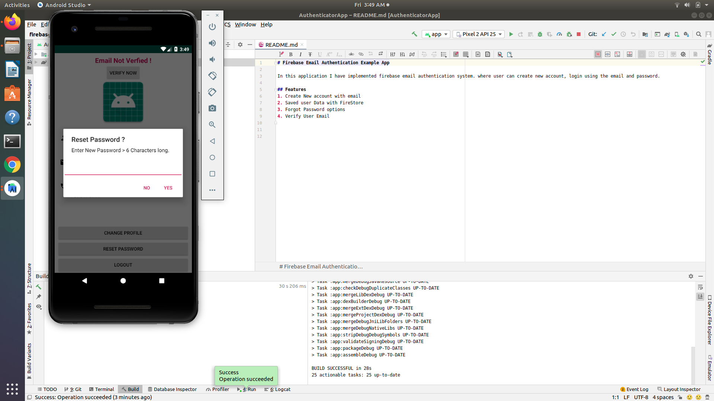

# Firebase_android_application

In this application I have implemented firebase email authentication system. where user can create new account, login using the email and password.

## Features 
1. Create New account with email
2. Saved user Data with FireStore 
3. Forgot Password options
4. Verify User Email

#Screenshots

Screenshot 1:

Screenshot 2:

Screenshot 3:

Screenshot 4:

Screenshot 5:

Screenshot 6:

Screenshot 7:

